# Diagrama de Clases - Predicción Mundial 2026

## Proyecto: Simulador de Convocatorias y Predicciones del Mundial

**Concepto:** Cada usuario es el DT de una selección, arma su convocatoria, elige titulares por partido y predice resultados.

## Diagrama Completo en Mermaid

```mermaid
classDiagram
    
    class Usuario {
        +Long internalId
        +String user
        +String email
        +String password
        +String oauthProvider
        +String oauthId
        +String nombre
        +String apellido
        +String telefono
        +String urlAvatar
        +Integer puntaje
        +Boolean perfilPublico
        +LocalDateTime transDate
        +LocalDateTime ultimoAcceso
        +Boolean activo
        --
        +crearConvocatoria()
        +crearPrediccion()
        +actualizarPerfil()
    }

    class Convocatoria {
        +Long internalId
        +Usuario usuario
        +Pais pais
        +LocalDateTime transDate
        +LocalDateTime endDate
        +Boolean cerrada
        +Integer totalJugadores
        +String estado
        --
        +agregarJugador()
        +quitarJugador()
        +cerrarLista()
        +esEditable()
    }
    
    note for Convocatoria "estado: EN_PROGRESO | CERRADA | EVALUADA"

    class Pais {
        +Long internalId
        +String nombre
        +String codigo
        +Confederacion confederacion
        +String grupo
        +Boolean activo
        +Integer pj
        +Integer pg
        +Integer pe
        +Integer pp
        +Integer pts
        +Long apiTeamId
        +String logoUrl
        +LocalDateTime ultimoSync
        --
        +obtenerJugadores()
        +obtenerPartidos()
    }

    class Confederacion {
        +Long internalId
        +String nombre
        +String codigo
        +String abreviatura
        +Boolean activo
    }

    class Fase {
        +Long internalId
        +String nombre
        +String codigo
        +Integer orden
        +Boolean activo
        --
        +obtenerPartidos()
    }

    class PosicionJugador {
        +Long internalId
        +String nombre
        +String codigo
        +String abreviatura
        +Boolean activo
    }

    class Club {
        +Long internalId
        +String nombre
        +String codigo
        +Pais pais
        +String urlEscudo
        +Boolean activo
        --
        +obtenerJugadores()
    }

    class Jugador {
        +Long internalId
        +Pais pais
        +PosicionJugador posicion
        +Club club
        +Long apiPlayerId
        +String nombre
        +String apellido
        +String nombreCompleto
        +LocalDate fechaNacimiento
        +Integer edad
        +Integer numeroCamiseta
        +String urlFoto
        +String statsJson
        +LocalDateTime ultimaStatsSync
        +Integer partidosTemporada
        +Boolean convocadoEliminatoria
        --
        +obtenerNombreCompleto()
        +obtenerPosicion()
        +obtenerClub()
    }

    note for Jugador "nombreCompleto: GENERATED ALWAYS — statsJson: JSONB con stats de API-Football — convocadoEliminatoria: true si fue convocado en eliminatorias"

    class Estadio {
        +Long internalId
        +String nombre
        +String ciudad
        +String pais
        +Integer capacidad
        +String urlFoto
        +Long apiVenueId
        +Boolean activo
        --
        +obtenerPartidos()
        +obtenerFoto()
    }

    note for Estadio "pais es String, no FK — Partido.estadio tambien es String (no FK a Estadio)"

    class Partido {
        +Long internalId
        +Pais equipoLocal
        +Pais equipoVisitante
        +Fase fase
        +Estadio estadioRef
        +LocalDateTime transDate
        +String estadio
        +Integer golLocal
        +Integer golVisitante
        +String estado
        +Boolean finalizado
        +LocalDateTime endDate
        --
        +puedeSeleccionarAlineacion()
        +estaFinalizado()
        +obtenerLimiteHorario()
    }
    
    note for Partido "estado: PENDIENTE | EN_CURSO | FINALIZADO — estadio_id FK a Estadio + estadio String redundante por compatibilidad"

    class ConvocatoriaRow {
        +Long internalId
        +Convocatoria convocatoria
        +Jugador jugador
        +String estado
        +LocalDateTime transDate
        --
        +cambiarEstado()
        +esPendiente()
        +esConvocado()
        +esNoVa()
        +esTitular()
    }
    
    note for ConvocatoriaRow "estado: PENDIENTE | CONVOCADO | NO_VA | TITULAR"

    class Alineacion {
        +Long internalId
        +Usuario usuario
        +Partido partido
        +Pais pais
        +LocalDateTime transDate
        +LocalDateTime fechaActualizacion
        +Boolean confirmada
        +String formacion
        +Integer totalJugadoresConvocados
        --
        +agregarJugador()
        +quitarJugador()
        +validar()
        +esEditable()
    }

    class AlineacionRow {
        +Long internalId
        +Alineacion alineacion
        +Jugador jugador
        +String estado
        --
        +esTitular()
        +esSuplente()
    }
    
    note for AlineacionRow "estado: TITULAR | SUPLENTE"

    class Prediccion {
        +Long internalId
        +Usuario usuario
        +Partido partido
        +Integer golLocal
        +Integer golVisitante
        +Boolean aprobada
        +Integer puntajeObtenido
        +LocalDateTime transDate
        +LocalDateTime fechaActualizacion
        --
        +calcularResultado()
        +esEditable()
        +esCorrecta()
    }

    class PrediccionTorneo {
        +Long internalId
        +Usuario usuario
        +Pais paisCampeon
        +Jugador jugadorGoleador
        +LocalDateTime transDate
        +LocalDateTime fechaActualizacion
        +LocalDateTime endDate
        +Boolean confirmada
        --
        +guardar()
        +esEditable()
        +esCorrecta()
    }

    class Mensaje {
        +Long internalId
        +Usuario usuario
        +String mensaje
        +LocalDateTime transDate
        --
        +guardar()
    }

    class Grupo {
        +Long internalId
        +Integer numero
        +String nombre
        +String premio
        +String codigoInvitacion
        +Usuario creador
        +LocalDateTime transDate
        +Boolean activo
        --
        +crearGrupo()
        +generarCodigo()
        +esActivo()
    }

    note for Grupo "codigoInvitacion: UNIQUE — puntaje calculado dinamicamente como SUM de puntajes de miembros"

    class GrupoRow {
        +Long internalId
        +Grupo grupo
        +Usuario usuario
        +String rol
        +Pais paisCampeon
        +Jugador goleador
        +LocalDateTime fechaUnion
        --
        +esCreador()
        +esMiembro()
        +tienePrediccion()
    }

    note for GrupoRow "rol: CREADOR | MIEMBRO — paisCampeonId y goleadorId se toman de PrediccionTorneo al unirse"

    class EquipoFavorito {
        +Long internalId
        +Usuario usuario
        +Pais pais
        +Integer orden
        +LocalDateTime transDate
        --
        +esValido()
    }

    note for EquipoFavorito "UNIQUE (usuarioId, paisId) y (usuarioId, orden) — max 5 por usuario"

    %% ==================== RELACIONES ====================
    
    Usuario "1" --> "*" Convocatoria : crea
    Usuario "1" --> "*" Alineacion : creaAlineaciones
    Usuario "1" --> "*" Prediccion : creaPredicciones
    Usuario "1" --> "0..1" PrediccionTorneo : tienePrediccionTorneo
    Usuario "1" --> "*" Mensaje : dejaMensajes
    Usuario "1" --> "*" Grupo : crea
    Usuario "1" --> "*" GrupoRow : participaEn
    Usuario "1" --> "*" EquipoFavorito : tieneFavoritos
    
    Convocatoria "*" --> "1" Pais : representa
    Convocatoria "1" --> "*" ConvocatoriaRow : tieneFilas
    
    Pais "*" --> "1" Confederacion : perteneceA
    Pais "1" --> "*" EquipoFavorito : esFavorito
    
    PrediccionTorneo "0..1" --> "1" Pais : paisCampeon
    PrediccionTorneo "0..1" --> "1" Jugador : jugadorGoleador
    
    ConvocatoriaRow "*" --> "1" Jugador : referencia
    ConvocatoriaRow "*" --> "1" Convocatoria : perteneceA
    
    Jugador "*" --> "1" Pais : perteneceA
    Jugador "*" --> "1" PosicionJugador : tienePosicion
    Jugador "*" --> "0..1" Club : juegaEn
    
    Club "*" --> "1" Pais : ubicadoEn
    
    Partido "*" --> "1" Pais : equipoLocal
    Partido "*" --> "1" Pais : equipoVisitante
    Partido "*" --> "1" Fase : perteneceAFase
    Partido "*" --> "0..1" Estadio : seJuegaEn
    
    Alineacion "*" --> "1" Usuario : creadaPor
    Alineacion "*" --> "1" Partido : paraPartido
    Alineacion "*" --> "1" Pais : paraEquipo
    Alineacion "1" --> "*" AlineacionRow : tieneFilas
    
    AlineacionRow "*" --> "1" Jugador : referencia
    
    Prediccion "*" --> "1" Usuario : creadaPor
    Prediccion "*" --> "1" Partido : paraPartido

    Grupo "1" --> "*" GrupoRow : tieneMiembros
    GrupoRow "*" --> "1" Pais : prediccionCampeon
    GrupoRow "*" --> "1" Jugador : prediccionGoleador
    PrediccionTorneo "1" ..> "1" GrupoRow : fuenteDePrediccionAlUnirse
```




## 📊 Descripción Detallada de Cada Tabla

### Caso de Uso: Usuario "alfredinho"
**Ejemplo:** Alfredinho crea 4 convocatorias:
- 🇧🇷 Brasil: 26 jugadores
- 🇵🇾 Paraguay: 15 jugadores (en progreso - muestra 15/23)
- 🇪🇸 España: 26 jugadores
- 🇦🇷 Argentina: 23 jugadores

---

### 1️⃣ **USUARIO** (`usuario`)
**¿Qué guarda?** Información de la cuenta del usuario.

**Ejemplo de registro:**
```
internalId: 1
user: "alfredinho"
email: "alfred@example.com"
password: "hash_encrypted"
oauthProvider: null  -- "google" si registró con Google
oauthId: null        -- ID externo del proveedor OAuth
nombre: "Alfredo"
apellido: "González"
urlAvatar: "/avatars/alfredinho.jpg"
puntaje: 850
perfilPublico: true
transDate: "2026-01-15 10:30:00"
ultimoAcceso: "2026-03-17 14:25:00"
activo: true
```

**Puntaje:** Acumula puntos por:
- Aciertos en convocatorias (+10 por jugador)
- Predicciones correctas de partidos (+50 resultado exacto, +25 resultado parcial)
- Predicción de campeón y goleador (+100 cada uno)

**`perfilPublico`:** Controla la visibilidad del perfil:
- `true` → Cualquier usuario puede buscar y ver su perfil, alineaciones y predicciones
- `false` → Perfil oculto, no aparece en búsquedas ni es accesible por otros
- Por defecto: `true` (el usuario puede cambiarlo en Configuración)

**Relación:** Un usuario puede crear MUCHAS convocatorias (1:N con Convocatoria).
---
### 2️⃣ **PAIS** (`pais`)
**¿Qué guarda?** Todos los países participantes del Mundial 2026.

**🏴 BANDERAS:** Se usa el campo `codigo` con la librería **flag-icons** en el frontend. No se guarda la bandera en la BD.

**Ejemplo de registros:**
```
internalId: 1, nombre: "Brasil", codigo: "BRA", confederacionId: 2 (CONMEBOL), apiTeamId: 6, ultimoSync: "2026-01-10 08:00:00", grupo: "A"
internalId: 2, nombre: "Paraguay", codigo: "PAR", confederacionId: 2 (CONMEBOL), apiTeamId: 18, ultimoSync: "2026-01-10 08:00:00", grupo: "B"
internalId: 3, nombre: "España", codigo: "ESP", confederacionId: 1 (UEFA), apiTeamId: 9, ultimoSync: "2026-01-10 08:00:00", grupo: "C"
internalId: 4, nombre: "Argentina", codigo: "ARG", confederacionId: 2 (CONMEBOL), apiTeamId: 26, ultimoSync: "2026-01-10 08:00:00", grupo: "A"
```

**Frontend:** `<span class="fi fi-{{ codigo.toLowerCase() }}"></span>` → Muestra 🇧🇷

**Relación:** 
- Un país pertenece a UNA confederación (N:1 con Confederacion).
- Un país tiene MUCHOS jugadores (1:N con Jugador).
- Un país tiene MUCHOS clubes ubicados en él (1:N con Club).

---

### 3️⃣ **CONFEDERACION** (`confederacion`) - TABLA DE CATÁLOGO
**¿Qué guarda?** Catálogo de las 6 confederaciones de fútbol del mundo (tabla de referencia precargada).

**Ejemplo de registros:**
```
internalId: 1, nombre: "Union of European Football Associations", codigo: "UEFA", abreviatura: "UEFA", activo: true
internalId: 2, nombre: "Confederación Sudamericana de Fútbol", codigo: "CONMEBOL", abreviatura: "CONMEBOL", activo: true
internalId: 3, nombre: "Confederation of North, Central America and Caribbean Association Football", codigo: "CONCACAF", abreviatura: "CONCACAF", activo: true
internalId: 4, nombre: "Confédération Africaine de Football", codigo: "CAF", abreviatura: "CAF", activo: true
internalId: 5, nombre: "Asian Football Confederation", codigo: "AFC", abreviatura: "AFC", activo: true
internalId: 6, nombre: "Oceania Football Confederation", codigo: "OFC", abreviatura: "OFC", activo: true
```

**Relación:** Una confederación tiene MUCHOS países (1:N con Pais).

---

### 4️⃣ **FASE** (`fase`) - TABLA DE CATÁLOGO
**¿Qué guarda?** Catálogo de las fases del Mundial 2026 (tabla de referencia precargada).

**Ejemplo de registros:**
```
internalId: 1, nombre: "Fase de Grupos", codigo: "GRUPOS", orden: 1, activo: true
internalId: 2, nombre: "Octavos de Final", codigo: "OCTAVOS", orden: 2, activo: true
internalId: 3, nombre: "Cuartos de Final", codigo: "CUARTOS", orden: 3, activo: true
internalId: 4, nombre: "Semifinales", codigo: "SEMIFINAL", orden: 4, activo: true
internalId: 5, nombre: "Tercer Puesto", codigo: "TERCER_PUESTO", orden: 5, activo: true
internalId: 6, nombre: "Final", codigo: "FINAL", orden: 6, activo: true
```

**Relación:** Una fase tiene MUCHOS partidos (1:N con Partido).

---

### 5️⃣ **POSICION_JUGADOR** (`posicion_jugador`) - TABLA DE CATÁLOGO
**¿Qué guarda?** Catálogo de posiciones de jugadores (tabla de referencia precargada).

**Ejemplo de registros:**
```
internalId: 1, nombre: "Arquero", codigo: "ARQ", abreviatura: "POR", activo: true
internalId: 2, nombre: "Defensa", codigo: "DEF", abreviatura: "DEF", activo: true
internalId: 3, nombre: "Mediocampista", codigo: "MED", abreviatura: "MED", activo: true
internalId: 4, nombre: "Delantero", codigo: "DEL", abreviatura: "FWD", activo: true
```

**Relación:** Una posición tiene MUCHOS jugadores (1:N con Jugador).

---

### 6️⃣ **CLUB** (`club`) - TABLA DE CATÁLOGO
**¿Qué guarda?** Catálogo de clubes de fútbol de todo el mundo (tabla de referencia precargada).

**⚽ ESCUDOS:** Se guardan URLs en campo `urlEscudo`. No existe una librería como flag-icons para clubes.

**💡 RECOMENDACIÓN PARA DESARROLLO:** Lo mejor es conseguir las imágenes .png de los escudos e ir subiéndolas localmente a `/public/assets/clubs/`. Sí, es trabajo de negros, pero es la mejor opción: control total, performance óptima, sin dependencias externas, y funciona offline. Vale la pena el esfuerzo inicial.

**Opciones para escudos:**
1. **Hospedar localmente** (recomendado): Descargar escudos y guardar en `/public/assets/clubs/`
   - Ejemplo: `/clubs/real-madrid.png`
2. **CDN externo**: Usar servicios como:
   - `https://cdn.sportmonks.com/images/soccer/teams/{id}.png`
   - `https://media.api-sports.io/football/teams/{id}.png` (API-Football)
3. **Crear colección propia**: SVGs optimizados (más control, más trabajo)

**Ejemplo de registros:**
```
-- Clubes de Brasil
internalId: 1, nombre: "Real Madrid CF", nombreCorto: "Real Madrid", codigo: "RMA", paisId: 3 (España), liga: "La Liga", urlEscudo: "/clubs/real-madrid.png", activo: true
internalId: 2, nombre: "Manchester City FC", nombreCorto: "Man City", codigo: "MCI", paisId: 10 (Inglaterra), liga: "Premier League", urlEscudo: "/clubs/man-city.png", activo: true
internalId: 3, nombre: "Paris Saint-Germain", nombreCorto: "PSG", codigo: "PSG", paisId: 8 (Francia), liga: "Ligue 1", urlEscudo: "/clubs/psg.png", activo: true
internalId: 4, nombre: "Al-Hilal SFC", nombreCorto: "Al-Hilal", codigo: "HIL", paisId: 15 (Arabia Saudita), liga: "Saudi Pro League", urlEscudo: "/clubs/al-hilal.png", activo: true
internalId: 5, nombre: "Aston Villa FC", nombreCorto: "Aston Villa", codigo: "AVL", paisId: 10 (Inglaterra), liga: "Premier League", urlEscudo: "/clubs/aston-villa.png", activo: true
internalId: 6, nombre: "Liverpool FC", nombreCorto: "Liverpool", codigo: "LIV", paisId: 10 (Inglaterra), liga: "Premier League", urlEscudo: "/clubs/liverpool.png", activo: true
internalId: 7, nombre: "Club Olimpia", nombreCorto: "Olimpia", codigo: "OLI", paisId: 2 (Paraguay), liga: "Primera División", urlEscudo: "/clubs/olimpia.png", activo: true
internalId: 8, nombre: "Club Cerro Porteño", nombreCorto: "Cerro Porteño", codigo: "CER", paisId: 2 (Paraguay), liga: "Primera División", urlEscudo: "/clubs/cerro.png", activo: true
```

**Relación:** 
- Un club pertenece a UN país (N:1 con Pais).
- Un club tiene MUCHOS jugadores (1:N con Jugador).

---

### 7️⃣ **JUGADOR** (`jugador`)
**¿Qué guarda?** Todos los jugadores REALES del Mundial 2026.

**Ejemplo de registros:**
```
-- Jugadores reales de Brasil
internalId: 100, nombre: "Vinícius", apellido: "Júnior", paisId: 1, posicionId: 4 (DEL), numeroCamiseta: 20, urlFoto: "/players/vinicius.jpg"
internalId: 101, nombre: "Neymar", apellido: "Jr", paisId: 1, posicionId: 4 (DEL), numeroCamiseta: 10, urlFoto: "/players/neymar.jpg"
internalId: 102, nombre: "Alisson", apellido: "Becker", paisId: 1, posicionId: 1 (ARQ), numeroCamiseta: 1, urlFoto: "/players/alisson.jpg"

-- Jugadores reales de Paraguay
internalId: 200, nombre: "Miguel", apellido: "Almirón", paisId: 2, posicionId: 3 (MED), numeroCamiseta: 10, urlFoto: "/players/almiron.jpg"
internalId: 201, nombre: "Gustavo", apellido: "Gómez", paisId: 2, posicionId: 2 (DEF), numeroCamiseta: 3, urlFoto: "/players/gomez.jpg"
```

**Relación:** 
- Un jugador pertenece a UN país (N:1 con Pais).
- Un jugador tiene UNA posición (N:1 con PosicionJugador).

---

### 8️⃣ **CONVOCATORIA** (`convocatoria`) - CABECERA
**¿Qué guarda?** La predicción de convocatoria de UN usuario para UN país (PRE-JUEGO de especulación).

**🔑 ESTO ES CLAVE:** Es un juego de PREDICCIÓN que se juega 2 semanas ANTES del Mundial. Cuando sale la convocatoria OFICIAL REAL, se comparan los jugadores y se otorgan puntos por cada acierto. Esta tabla NO se usa durante los partidos.

**🚨 RESTRICCIÓN IMPORTANTE:** Un usuario puede hacer VARIAS convocatorias, pero solo UNA por país. La combinación `(usuarioId, paisId)` debe ser ÚNICA.

**Patrón Cabecera-Detalle:** Convocatoria (master) → ConvocatoriaRow (detalle con los jugadores)

**Ejemplo de registros para alfredinho:**
```
-- Convocatoria de Brasil (completa)
internalId: 10, usuarioId: 1, paisId: 1, totalJugadores: 26, cerrada: true, estado: "EVALUADA", transDate: "2026-01-20", endDate: "2026-02-01"

-- Convocatoria de Paraguay (en progreso 15/23)
internalId: 11, usuarioId: 1, paisId: 2, totalJugadores: 15, cerrada: false, estado: "EN_PROGRESO", transDate: "2026-02-05"

-- Convocatoria de España (completa)
internalId: 12, usuarioId: 1, paisId: 3, totalJugadores: 26, cerrada: true, estado: "EVALUADA", transDate: "2026-02-10", endDate: "2026-02-20"

-- Convocatoria de Argentina (completa)
internalId: 13, usuarioId: 1, paisId: 4, totalJugadores: 23, cerrada: true, estado: "EVALUADA", transDate: "2026-02-15", endDate: "2026-02-25"
```

**Relación:** 
- Una convocatoria pertenece a UN usuario (N:1 con Usuario).
- Una convocatoria representa UN país (N:1 con Pais).
- **UNIQUE (usuarioId, paisId)**: Un usuario solo puede tener 1 convocatoria por país.
- Una convocatoria tiene MUCHOS jugadores a través de ConvocatoriaRow (1:N).

**Visual en UI:** Para Paraguay muestra: `15/23` con barra amarilla (no completa).

---

### 9️⃣ **CONVOCATORIA_ROW** (`convocatoria_row`) - DETALLE
**¿Qué guarda?** Cada fila representa UN jugador dentro de una convocatoria. Es el DETALLE de la cabecera Convocatoria.

**🔑 PATRÓN CABECERA-DETALLE:**
- **Convocatoria** (1) → **ConvocatoriaRow** (N)
- Cada row tiene: `masterId` que apunta a la cabecera

**🚨 LÓGICA DE PRECARGA AUTOMÁTICA:**
Cuando un usuario crea una convocatoria y elige un país, el sistema **PRECARGA automáticamente 40-50 jugadores** de la tabla oficial Jugador (cargada previamente por el admin).

1. Usuario crea convocatoria para Paraguay → Sistema inserta 40-50 ConvocatoriaRow con estado "PENDIENTE"
2. Usuario cambia estados: PENDIENTE → CONVOCADO / NO_VA
3. Dentro de los CONVOCADOS, puede marcar hasta 11 como TITULAR (formación titular)
4. **Máximo 26 CONVOCADOS**: Cuando llega a 26 CONVOCADOS, los demás se deshabilitan (no se pueden cambiar a CONVOCADO)

**Ejemplo de registros para la convocatoria de Paraguay de alfredinho (masterId: 11):**
```
-- El sistema precargó 50 jugadores, alfredinho ya marcó 15 como CONVOCADO:

internalId: 500, masterId: 11, jugadorId: 200, estado: "CONVOCADO", transDate: "2026-02-05"
internalId: 501, masterId: 11, jugadorId: 201, estado: "CONVOCADO", transDate: "2026-02-05"
internalId: 502, masterId: 11, jugadorId: 202, estado: "PENDIENTE", transDate: "2026-02-05"
internalId: 503, masterId: 11, jugadorId: 203, estado: "CONVOCADO", transDate: "2026-02-05"
...
internalId: 514, masterId: 11, jugadorId: 214, estado: "NO_VA", transDate: "2026-02-05"
...
internalId: 549, masterId: 11, jugadorId: 249, estado: "PENDIENTE", transDate: "2026-02-05"
-- (50 registros precargados en total)
```

**Estados posibles:**
- `PENDIENTE`: Estado inicial (precargado), usuario aún no decidió
- `CONVOCADO`: Usuario confirmó que va al Mundial (máximo 26)
- `TITULAR`: Jugador convocado elegido como titular (máximo 11, subconjunto de CONVOCADO)
- `NO_VA`: Usuario decidió que no lo lleva

**Relación:**
- Pertenece a UNA convocatoria (N:1 con Convocatoria).
- Referencia a UN jugador de la tabla oficial (N:1 con Jugador).

**Visual en UI:** Cuenta CONVOCADOS para mostrar `15/26` en Paraguay.

---

### 🔟 **PARTIDO** (`partido`)
**¿Qué guarda?** Todos los partidos del Mundial 2026 con sus fechas, horarios y resultados.

**Ejemplo de registros:**
```
-- Fase de grupos
internalId: 1, equipoLocalId: 1 (Brasil), equipoVisitanteId: 5 (Serbia), faseId: 1 (GRUPOS), transDate: "2026-06-11 14:00:00", estadio: "Estadio Azteca", golLocal: 2, golVisitante: 0, estado: "FINALIZADO", finalizado: true

internalId: 2, equipoLocalId: 2 (Paraguay), equipoVisitanteId: 6 (Nigeria), faseId: 1 (GRUPOS), transDate: "2026-06-12 17:00:00", estadio: "MetLife Stadium", golLocal: NULL, golVisitante: NULL, estado: "PENDIENTE", finalizado: false

-- Final
internalId: 64, equipoLocalId: NULL, equipoVisitanteId: NULL, faseId: 6 (FINAL), transDate: "2026-07-19 15:00:00", estadio: "MetLife Stadium", golLocal: NULL, golVisitante: NULL, estado: "PENDIENTE", finalizado: false
```

**Relación:** 
- Un partido tiene DOS países: equipo local y equipo visitante (2 FK a Pais).
- Un partido pertenece a UNA fase (N:1 con Fase).

---

### 1️⃣1️⃣ **ALINEACION** (`alineacion`) - CABECERA
**¿Qué guarda?** La predicción de alineación (cabecera) que hace un usuario para un equipo específico en un partido específico.

**🔑 ESTO ES CLAVE:** 
- 1 Partido tiene 2 Alineaciones (Equipo A + Equipo B)
- Cada usuario puede predecir AMBAS alineaciones
- Los jugadores se eligen de la CONVOCATORIA OFICIAL REAL (no de la predicción del usuario)

**Patrón Cabecera-Detalle:** Alineacion (master) → AlineacionRow (detalle con los jugadores)

**Ejemplo para alfredinho en el partido Brasil vs Serbia:**
```
-- Alineación de Brasil (usuarioId: 1)
internalId: 100, usuarioId: 1, partidoId: 1, paisId: 1 (Brasil), totalJugadoresConvocados: 18, formacion: "4-3-3", confirmada: true, transDate: "2026-06-10"

-- Alineación de Serbia (usuarioId: 1) - ¡Mismo usuario predice AMBOS equipos!
internalId: 101, usuarioId: 1, partidoId: 1, paisId: 5 (Serbia), totalJugadoresConvocados: 18, formacion: "4-4-2", confirmada: true, transDate: "2026-06-10"
```

**Interpretación:**
- Alfredinho predice cómo jugará Brasil (18 jugadores: 11 titulares + 7 suplentes)
- Alfredinho también predice cómo jugará Serbia (18 jugadores: 11 titulares + 7 suplentes)
- Cada jugador se guarda en AlineacionRow con su posición y rol

**Relación:**
- Pertenece a UN usuario (N:1 con Usuario) - quien hace la predicción
- Es para UN partido (N:1 con Partido) - qué partido
- Es para UN país (N:1 con Pais) - qué equipo del partido
- Contiene MUCHOS jugadores a través de AlineacionRow (1:N)

---

### 1️⃣2️⃣ **ALINEACION_ROW** (`alineacion_row`) - DETALLE
**¿Qué guarda?** Cada fila representa UN jugador dentro de una alineación con su estado (titular o suplente). Es el DETALLE de la cabecera Alineacion.

**🔑 PATRÓN CABECERA-DETALLE:**
- **Alineacion** (1) → **AlineacionRow** (N)
- Cada row tiene: `masterId` que apunta a la cabecera
- Cada row tiene: `estado` ("TITULAR" o "SUPLENTE")
- Los jugadores se eligen de la CONVOCATORIA OFICIAL REAL del país

**Ejemplo para la alineación de Brasil predicha por alfredinho (masterId: 100):**
```
-- TITULARES (11 jugadores con estado = "TITULAR")
internalId: 1000, masterId: 100, jugadorId: 100, estado: "TITULAR" -- Alisson (ARQ)
internalId: 1001, masterId: 100, jugadorId: 105, estado: "TITULAR" -- Danilo (DEF)
internalId: 1002, masterId: 100, jugadorId: 106, estado: "TITULAR" -- Marquinhos (DEF)
internalId: 1003, masterId: 100, jugadorId: 107, estado: "TITULAR" -- Gabriel (DEF)
internalId: 1004, masterId: 100, jugadorId: 108, estado: "TITULAR" -- Alex Sandro (DEF)
internalId: 1005, masterId: 100, jugadorId: 115, estado: "TITULAR" -- Casemiro (MED)
internalId: 1006, masterId: 100, jugadorId: 116, estado: "TITULAR" -- Bruno Guimarães (MED)
internalId: 1007, masterId: 100, jugadorId: 117, estado: "TITULAR" -- Paquetá (MED)
internalId: 1008, masterId: 100, jugadorId: 120, estado: "TITULAR" -- Vinícius (DEL)
internalId: 1009, masterId: 100, jugadorId: 121, estado: "TITULAR" -- Neymar (DEL)
internalId: 1010, masterId: 100, jugadorId: 122, estado: "TITULAR" -- Richarlison (DEL)

-- SUPLENTES (7 jugadores con estado = "SUPLENTE")
internalId: 1011, masterId: 100, jugadorId: 102, estado: "SUPLENTE" -- Ederson (ARQ)
internalId: 1012, masterId: 100, jugadorId: 110, estado: "SUPLENTE" -- Militão (DEF)
internalId: 1013, masterId: 100, jugadorId: 111, estado: "SUPLENTE" -- Bremer (DEF)
internalId: 1014, masterId: 100, jugadorId: 118, estado: "SUPLENTE" -- Douglas Luiz (MED)
internalId: 1015, masterId: 100, jugadorId: 123, estado: "SUPLENTE" -- Raphinha (DEL)
internalId: 1016, masterId: 100, jugadorId: 124, estado: "SUPLENTE" -- Gabriel Jesus (DEL)
internalId: 1017, masterId: 100, jugadorId: 125, estado: "SUPLENTE" -- Rodrygo (DEL)
```

**Relación:**
- Pertenece a UNA alineación (N:1 con Alineacion)
- Referencia directamente a UN jugador REAL (N:1 con Jugador) - de la convocatoria oficial

**Visual en UI:** 
- Muestra los 11 titulares en la cancha con formación 4-3-3
- Muestra los 7 suplentes en el banco

---

### 1️⃣3️⃣ **PREDICCION** (`prediccion`)
**¿Qué guarda?** La predicción de resultado que hace el usuario para cualquier partido del Mundial.

**🔑 CAMPOS CLAVE:**
- `golLocal` / `golVisitante`: Goles predichos para cada equipo
- `aprobada`: Se cambia automáticamente a `true` cuando el partido empieza (cierre de predicciones)
- `puntajeObtenido`: Puntos ganados después del partido (calculado por `calcularResultado()`)
- **Resultado:** Se calcula dinámicamente comparando `golLocal` vs `golVisitante` (GANA_LOCAL/EMPATE/GANA_VISITANTE)

**🤖 CIERRE AUTOMÁTICO:** Un procedimiento almacenado ejecuta cada minuto y cierra predicciones (`aprobada = true`) cuando el partido comienza.

**Ejemplo para alfredinho:**
```
-- Predicción para Brasil vs Serbia (ANTES del partido)
internalId: 200, usuarioId: 1, partidoId: 1, golLocal: 2, golVisitante: 0, aprobada: false, puntajeObtenido: NULL, transDate: "2026-06-10"
-- Usuario puede modificar mientras aprobada = false

-- DESPUÉS que empieza el partido (sistema ejecuta procedimiento almacenado)
internalId: 200, usuarioId: 1, partidoId: 1, golLocal: 2, golVisitante: 0, aprobada: true, puntajeObtenido: NULL
-- Ya no se puede modificar (aprobada = true)

-- DESPUÉS que termina el partido (resultado real: Brasil 2-0 Serbia)
internalId: 200, usuarioId: 1, partidoId: 1, golLocal: 2, golVisitante: 0, aprobada: true, puntajeObtenido: 50
-- calcularResultado() otorgó 50 puntos (acertó resultado exacto)

-- Predicción para Paraguay vs Nigeria
internalId: 201, usuarioId: 1, partidoId: 2, golLocal: 1, golVisitante: 1, aprobada: true, puntajeObtenido: 25
-- Resultado calculado: EMPATE (1 == 1) → 25 puntos

-- Predicción para Argentina vs México (falló)
internalId: 202, usuarioId: 1, partidoId: 5, golLocal: 0, golVisitante: 2, aprobada: true, puntajeObtenido: 0
-- Resultado calculado: GANA_VISITANTE pero real fue GANA_LOCAL → 0 puntos
```

**Estados:**
- `aprobada = false`: Usuario puede modificar la predicción
- `aprobada = true`: Partido ya empezó, predicción cerrada
- `puntajeObtenido = NULL`: Partido aún no terminó
- `puntajeObtenido > 0`: Partido terminó y ganó puntos
- `puntajeObtenido = 0`: Partido terminó y no acertó

**Relación:**
- Pertenece a UN usuario (N:1 con Usuario)
- Es para UN partido (N:1 con Partido)

---

### 1️⃣4️⃣ **PREDICCION_TORNEO** (`prediccion_torneo`)
**¿Qué guarda?** La predicción general del usuario sobre quién ganará el Mundial y quién será el goleador.

**Importante:** Cada usuario puede tener SOLO 1 PrediccionTorneo (no una por convocatoria).

**Ejemplo para alfredinho:**
```
-- Predicción de alfredinho sobre el torneo completo
internalId: 50, usuarioId: 1, paisCampeonId: 1 (Brasil), jugadorGoleadorId: 100 (Vinícius), confirmada: true, endDate: "2026-06-15"
```

**Interpretación:** Alfredinho predice que Brasil será campeón y Vinícius será el goleador del Mundial (independiente de sus convocatorias).

**Relación:**
- Pertenece a UN usuario (0..1:1 con Usuario) - Cada usuario solo puede tener 1 PrediccionTorneo.
- Referencia a UN país campeón (N:1 con Pais).
- Referencia a UN jugador goleador (N:1 con Jugador).

---

## 📊 Flujo de Datos Completo para "alfredinho"

### ⏰ **FASE 1: PRE-MUNDIAL (2 semanas antes)** - Juego de Especulación

#### **Paso 1:** Crear convocatoria de Paraguay (precarga automática)
```sql
-- 1. Se crea el registro en CONVOCATORIA
INSERT INTO convocatoria (usuarioId, paisId, totalJugadores, cerrada)
VALUES (1, 2, 0, false);
-- Retorna: internalId = 11

-- 2. Sistema PRECARGA automáticamente 50 jugadores de Paraguay desde tabla Jugador
INSERT INTO convocatoria_row (masterId, jugadorId, estado, transDate)
SELECT 11, internalId, 'PENDIENTE', NOW() 
FROM jugador 
WHERE paisId = 2 
ORDER BY posicion, apellido 
LIMIT 50;
-- Se crean 50 registros automáticamente con estado PENDIENTE
```

### **Paso 2:** Usuario marca jugadores como CONVOCADO (15 de 26)
```sql
-- Alfredinho cambia el estado de PENDIENTE a CONVOCADO para 15 jugadores:
UPDATE convocatoria_row SET estado = 'CONVOCADO' WHERE internalId = 500; -- Almirón
UPDATE convocatoria_row SET estado = 'CONVOCADO' WHERE internalId = 501; -- Gómez
UPDATE convocatoria_row SET estado = 'CONVOCADO' WHERE internalId = 503; -- Romero
...
-- (15 cambios de estado)

-- Sistema actualiza el total en CONVOCATORIA (cabecera)
UPDATE convocatoria SET totalJugadores = 15 WHERE internalId = 11;
```

**UI muestra:** `15/26` con barra amarilla ⚠️ (faltan 11 para completar)

### **Paso 3:** Cuando completa 26 jugadores CONVOCADOS
```sql
-- Alfredinho marca 11 jugadores más como CONVOCADO
UPDATE convocatoria SET totalJugadores = 26, cerrada = true WHERE internalId = 11;
```

**UI muestra:** `26/26` con barra verde ✅ (lista cerrada, los demás 24 quedan en PENDIENTE/NO_VA)

### **Paso 4:** Comparar con convocatoria oficial y otorgar puntos
```sql
-- La federación brasileña anuncia la convocatoria oficial real
-- Sistema compara automáticamente:
-- Alfredinho puso a Neymar → Neymar SÍ está en la oficial → +10 puntos
-- Alfredinho puso a Vinicius → Vinicius SÍ está en la oficial → +10 puntos
-- Alfredinho puso a jugador X → jugador X NO está en la oficial → 0 puntos

-- Resultado: Alfredinho acertó 20/26 jugadores → Suma 200 puntos
INSERT INTO puntuacion_convocatoria (usuarioId, convocatoriaId, aciertos, puntosGanados)
VALUES (1, 11, 20, 200);
```

**🎮 GAMIFICACIÓN:** La convocatoria del usuario ya cumplió su propósito (dar puntos). Ahora comienza el Mundial.

---

### ⚽ **FASE 2: DURANTE EL MUNDIAL** - Predicción de Alineaciones y Resultados

### **Paso 5:** Predecir alineación para un partido (usando convocatoria OFICIAL REAL)
```sql
-- Partido: Brasil vs Serbia (partidoId: 1)

-- 5a. Alfredinho predice la alineación de BRASIL
INSERT INTO alineacion (usuarioId, partidoId, paisId, totalJugadoresConvocados, formacion)
VALUES (1, 1, 1, 18, '4-3-3');
-- Retorna: internalId = 100

-- 5b. Alfredinho predice la alineación de SERBIA (¡mismo usuario, otro equipo!)
INSERT INTO alineacion (usuarioId, partidoId, paisId, totalJugadoresConvocados, formacion)
VALUES (1, 1, 5, 18, '4-4-2');
-- Retorna: internalId = 101

-- 5c. Se agregan los jugadores (rows) de la CONVOCATORIA OFICIAL REAL de Brasil
-- TITULARES de Brasil:
INSERT INTO alineacion_row (masterId, jugadorId, estado)
VALUES (100, 100, 'TITULAR'); -- Alisson (ARQ)
VALUES (100, 105, 'TITULAR'); -- Danilo (DEF)
VALUES (100, 106, 'TITULAR'); -- Marquinhos (DEF)
...
-- (11 titulares)

-- SUPLENTES de Brasil:
INSERT INTO alineacion_row (masterId, jugadorId, estado)
VALUES (100, 102, 'SUPLENTE'); -- Ederson (ARQ)
VALUES (100, 110, 'SUPLENTE'); -- Militão (DEF)
...
-- (7 suplentes)

-- 5d. Se agregan los jugadores (rows) de la CONVOCATORIA OFICIAL REAL de Serbia
-- TITULARES de Serbia:
INSERT INTO alineacion_row (masterId, jugadorId, estado)
VALUES (101, 500, 'TITULAR'); -- Rajković (ARQ)
VALUES (101, 505, 'TITULAR'); -- Pavlović (DEF)
...
-- (11 titulares)

-- SUPLENTES de Serbia:
INSERT INTO alineacion_row (masterId, jugadorId, estado)
VALUES (101, 502, 'SUPLENTE'); -- Milinković (ARQ)
...
-- (7 suplentes)
```

### **Paso 6:** Predecir resultado del partido
```sql
-- Usuario crea predicción ANTES del partido
INSERT INTO prediccion (usuarioId, partidoId, golLocal, golVisitante, aprobada, puntajeObtenido)
VALUES (1, 1, 2, 0, false, NULL); -- Brasil gana 2-0 (aún puede modificar)

-- Sistema ejecuta procedimiento almacenado cuando el partido empieza
UPDATE prediccion SET aprobada = true 
WHERE partidoId IN (SELECT internalId FROM partido WHERE transDate <= NOW() AND finalizado = false);

-- Después del partido, sistema calcula puntos
UPDATE prediccion SET puntajeObtenido = 50 WHERE internalId = 200; -- Acertó exacto
```

### **Paso 7:** Predecir campeón y goleador del torneo
```sql
INSERT INTO prediccion_torneo (usuarioId, paisCampeonId, jugadorGoleadorId)
VALUES (1, 1, 100); -- Brasil campeón, Vinícius goleador (solo 1 predicción por usuario)
```

---

## 🎯 Resumen Visual

```
USUARIO (alfredinho)
    │
    ├── 🎮 FASE 1: CONVOCATORIAS (Pre-Mundial) - Juego de Especulación
    │   │
    │   ├── CONVOCATORIA [Brasil] (cabecera) ✅ → Acertó 20/26 → +200 puntos
    │   │       └── CONVOCATORIA_ROW (26 filas: Neymar, Vinícius, Alisson...)
    │   │
    │   ├── CONVOCATORIA [Paraguay] (cabecera) ✅ → Acertó 18/23 → +180 puntos
    │   │       └── CONVOCATORIA_ROW (23 filas: Almirón, Gómez, Romero...)
    │   │
    │   ├── CONVOCATORIA [España] (cabecera) ✅ → Acertó 22/26 → +220 puntos
    │   │       └── CONVOCATORIA_ROW (26 filas: Morata, Pedri, Rodri...)
    │   │
    │   └── CONVOCATORIA [Argentina] (cabecera) ✅ → Acertó 21/23 → +210 puntos
    │           └── CONVOCATORIA_ROW (23 filas: Messi, Di María, Martínez...)
    │
    └── ⚽ FASE 2: PREDICCIONES DE PARTIDOS (Durante el Mundial)
        │
        ├── PARTIDO 1: Brasil vs Serbia
        │   ├── ALINEACION [Brasil] (cabecera) - 18 jugadores de convocatoria OFICIAL
        │   │   └── ALINEACION_ROW (18 filas: 11 titulares + 7 suplentes)
        │   │
        │   ├── ALINEACION [Serbia] (cabecera) - 18 jugadores de convocatoria OFICIAL
        │   │   └── ALINEACION_ROW (18 filas: 11 titulares + 7 suplentes)
        │   │
        │   └── PREDICCION: Brasil gana 2-0
        │
        ├── PARTIDO 2: Paraguay vs Nigeria
        │   ├── ALINEACION [Paraguay] (cabecera)
        │   │   └── ALINEACION_ROW (18 filas)
        │   │
        │   ├── ALINEACION [Nigeria] (cabecera)
        │   │   └── ALINEACION_ROW (18 filas)
        │   │
        │   └── PREDICCION: Empate 1-1
        │
        └── PREDICCION_TORNEO: Brasil campeón + Vinícius goleador
```

---

## Reglas de Negocio Principales

### 1. **Convocatoria (Roster) - FASE 1: PRE-MUNDIAL**
- **PROPÓSITO:** Juego de especulación que se juega 2 semanas ANTES del Mundial
- Cada usuario puede crear **múltiples convocatorias** (de diferentes selecciones)
- Debe tener entre **23 y 26 jugadores**
- Distribución típica:
  - 3 Porteros (ARQ)
  - 8-10 Defensas (DEF)
  - 8-10 Mediocampistas (MED)
  - 4-6 Delanteros (DEL)
- Estados de jugador: **PENDIENTE**, **CONVOCADO**, **NO VA**
- **GAMIFICACIÓN:** Cuando sale la convocatoria OFICIAL REAL, se comparan los jugadores:
  - Cada acierto: +10 puntos
  - Ejemplo: Acertó 20/26 → +200 puntos
- **IMPORTANTE:** Esta convocatoria NO se usa para armar alineaciones de partidos

### 2. **Jugadores (Player)**
- **Solo jugadores REALES** del Mundial 2026
- Base de datos pre-cargada con todos los jugadores oficiales
- Campos: nombre, apellido, posición, número, foto, fecha de nacimiento
- Posiciones: **ARQ** (Arquero), **DEF** (Defensa), **MED** (Mediocampista), **DEL** (Delantero)

### 3. **Alineación para un Partido (Lineup) - FASE 2: DURANTE EL MUNDIAL**
La tabla **Alineacion** almacena la predicción de alineación para un equipo en un partido:
- **CADA USUARIO predice la alineación de AMBOS equipos** en un partido
- **16-20 jugadores totales** por equipo (titulares + suplentes)
- **11 titulares** (campo `esTitular = true`)
  - **Obligatorio: 1 arquero titular**
  - Resto: libre distribución según táctica (ej: 4-4-2, 3-5-2)
- **5-9 suplentes** (campo `esSuplente = true`)
- **CLAVE:** Los jugadores se eligen de la **CONVOCATORIA OFICIAL REAL** del país (no de la predicción del usuario)
- Se puede modificar hasta el deadline del partido (generalmente antes del kickoff)
- Relación: `Alineacion` → `Usuario` + `Partido` + `Pais`
- `AlineacionRow` contiene:
  - FK a `Jugador` (directamente a la tabla Jugador - convocatoria oficial real)
  - `estado`: "TITULAR" (arranca el partido) o "SUPLENTE" (está en el banco)

### 4. **Predicción de Resultados (Prediction)**
- Por cada partido, se puede predecir:
  - **GANA** - La selección gana
  - **EMPATA** - Empate
  - **PIERDE** - La selección pierde
- **Fase Actual:** Solo resultado (G/E/P)
- **Futuro:** 
  - Marcador exacto (ej: 2-1)
  - Goleadores
  - Tarjetas
  - Etc.

### 5. **Partidos (Matches)**
- Todos los partidos del Mundial 2026
- Etapas: Fase de Grupos, Octavos, Cuartos, Semifinales, Final
- Cada partido tiene:
  - Fecha y hora
  - Estadio
  - Selecciones (local/visitante)
  - Deadline para cambios (generalmente 1-2hs antes)

### 6. **Predicciones del Torneo (Tournament Prediction)**
- **Una predicción general por convocatoria**
- El usuario predice:
  - **País Campeón** (FK a Pais)
  - **Goleador del Torneo** (FK a Jugador)
- Se puede modificar hasta una **fecha límite** (ej: antes de que empiece el Mundial o antes de octavos)
- Una vez confirmada o pasado el deadline, ya no se puede cambiar
- Al finalizar el torneo, se valida si fue correcta

### 7. **Restricciones y Validaciones**
- **Convocatoria:**
  - Mínimo 23, máximo 26 jugadores
  - Al menos 3 porteros obligatorios
  - No se puede cerrar con menos de 23 jugadores
  
- **Alineación (Convocados al Partido):**
  - Mínimo 16, máximo 20 jugadores por partido
  - Exactamente 11 titulares
  - 5-9 suplentes
  - Todos deben tener estado CONVOCADO en la Convocatoria general
  - Al menos 1 arquero entre los convocados
  
- **Titulares:**
  - Exactamente 11 jugadores con `estado = "TITULAR"`
  - Exactamente 1 arquero
  - No se puede modificar después del kickoff
  
- **Predicción:**
  - Una predicción por partido
  - Se puede cambiar hasta el kickoff
  - Después del partido: se marca si fue correcta o no

- **Predicción del Torneo:**
  - Una por convocatoria (opcional)
  - Debe seleccionar: país campeón Y goleador
  - Se puede modificar hasta fecha límite configurada
  - Una vez confirmada, no se puede cambiar

### 8. **Control de Sesión y Seguridad**
- **JWT con Expiración:**
  - Desarrollo: 1 hora (3600000 ms)
  - Producción: 24 horas (86400000 ms)
  - Token almacenado en `localStorage` del navegador
  - Backend valida el token en cada request
  
- **Verificación Automática:**
  - Al cambiar de pestaña y volver, verifica si el token expiró
  - Si el backend rechaza el token (401/403), ejecuta logout automático
  - Interceptor HTTP agrega el token a cada request
  
- **Protección de Rutas:**
  - `authGuard`: Protege rutas que requieren autenticación
  - `loginGuard`: Evita que usuarios logueados vean el login
  - Redirección automática a dashboard si ya está autenticado

## Casos de Uso Principales

### 1. **Crear Convocatoria (Predicción Pre-Mundial)**
1. Usuario elige una selección (ej: Argentina, Brasil, España)
2. Sistema crea la cabecera: `Convocatoria (usuarioId, paisId)`
3. Usuario busca/selecciona jugadores REALES de la base de datos
4. Por cada jugador, se crea un `ConvocatoriaRow` con estado: PENDIENTE/CONVOCADO/NO_VA/TITULAR
5. Debe completar entre 23-26 jugadores
6. Sistema valida: mínimo 3 arqueros
7. Guarda convocatoria completa

### 2. **Cerrar Lista de Convocados**
1. Usuario confirma que terminó su convocatoria
2. Sistema valida: 23-26 jugadores, al menos 3 ARQ
3. Se marca como "cerrada" (timestamp)
4. A partir de ese momento:
   - No se pueden agregar/quitar jugadores
   - Solo se puede cambiar estados y armar titulares

### 3. **Predecir Alineación para un Partido**
1. Usuario selecciona un partido (ej: Brasil vs Serbia)
2. Sistema crea la cabecera: `Alineacion (usuarioId, partidoId, paisId)` para cada equipo
3. Usuario ve la CONVOCATORIA OFICIAL REAL del país (26 jugadores disponibles)
4. Usuario selecciona **16-20 jugadores** que van al partido:
   - Al menos 1 arquero
   - Resto: libre (defensas, mediocampistas, delanteros)
5. Por cada jugador seleccionado, se crea un `AlineacionRow` con:
   - `estado = "TITULAR"` (11 jugadores) → Arrancan el partido
   - `estado = "SUPLENTE"` (5-9 jugadores) → Van al banco
6. Define formación visual (ej: 4-4-2, 3-5-2, 4-3-3)
7. Sistema valida: exactamente 11 titulares (1 ARQ obligatorio)
8. Guarda alineación completa
9. Puede modificar hasta el deadline del partido (antes del kickoff)

### 4. **Predecir Resultado**
1. Usuario entra al partido
2. Ingresa goles predichos: golesLocal y golesVisitante
3. Sistema calcula automáticamente el resultado:
   - Si golesLocal > golesVisitante → GANA_LOCAL
   - Si golesLocal < golesVisitante → GANA_VISITANTE  
   - Si golesLocal == golesVisitante → EMPATE
4. Guarda predicción (solo los goles, el resultado se calcula)
5. Puede modificar hasta kickoff

### 5. **Predecir Campeón y Goleador del Torneo**
1. Usuario entra a su convocatoria
2. Accede a sección "Predicciones del Torneo"
3. Selecciona país que será campeón (lista de todos los países participantes)
4. Selecciona jugador que será goleador (lista de todos los jugadores del torneo)
5. Guarda predicción
6. Puede modificar hasta la fecha límite (ej: antes de octavos de final)
7. Sistema valida al finalizar el torneo y marca si fue correcta

### 6. **Ver Perfil Público de Usuario**
1. Usuario comparte su perfil: `https://app.com/user/{usuarioId}`
2. Visitantes ven:
   - Convocatorias creadas (por país)
   - Puntos obtenidos en cada convocatoria
   - Alineaciones predichas por partido
   - Predicciones de resultados
   - **Predicción del torneo: Campeón y Goleador**
   - Ranking general del usuario
3. Vista de solo lectura (sin login)

## Índices Recomendados para Performance

```sql
-- Users
CREATE INDEX idx_user_email ON users(email);
CREATE INDEX idx_user_username ON users(username);

-- Rosters
CREATE INDEX idx_roster_user ON rosters(user_id);
CREATE INDEX idx_roster_country ON rosters(country_id);

-- Players
CREATE INDEX idx_player_country ON players(country_id);
CREATE INDEX idx_player_position ON players(position);

-- Matches
CREATE INDEX idx_match_date ON matches(match_date);
CREATE INDEX idx_match_home_country ON matches(home_country_id);
CREATE INDEX idx_match_away_country ON matches(away_country_id);
CREATE INDEX idx_match_status ON matches(status);

-- RosterPlayers
CREATE INDEX idx_roster_player_roster ON roster_players(roster_id);
CREATE INDEX idx_roster_player_player ON roster_players(player_id);
CREATE INDEX idx_roster_player_status ON roster_players(status);

-- Lineups
CREATE INDEX idx_lineup_roster ON lineups(roster_id);
CREATE INDEX idx_lineup_match ON lineups(match_id);

-- Predictions
CREATE INDEX idx_prediction_roster ON predictions(roster_id);
CREATE INDEX idx_prediction_match ON predictions(match_id);

-- Tournament Predictions
CREATE INDEX idx_tournament_prediction_roster ON tournament_predictions(roster_id);
CREATE INDEX idx_tournament_prediction_champion ON tournament_predictions(champion_country_id);
CREATE INDEX idx_tournament_prediction_top_scorer ON tournament_predictions(top_scorer_player_id);
```

## Roadmap de Funcionalidades

### ✅ Fase 1: MVP (Lanzamiento Inicial)
- Crear convocatoria (23-26 jugadores)
- Estados: PENDIENTE/CONVOCADO/NO VA
- Agregar jugadores personalizados con foto
- Armar XI titular por partido (11 jugadores, 1 ARQ obligatorio)
- Predecir resultado: GANA/EMPATA/PIERDE
- Vista de resumen global

### 🔜 Fase 2: Predicciones Avanzadas
- Predicción de marcador exacto (ej: 2-1, 3-0)
- Predicción de goleadores
- Predicción de tarjetas
- Predicción de MVP del partido

### 🔜 Fase 3: Gamificación
- Sistema de puntos por predicciones acertadas
- Ranking global de usuarios
- Ranking por países
- Badges y logros
- Comparación con amigos

### 🔜 Fase 4: Social
- Perfil público de usuario
- Seguir a otros usuarios
- Feed de actividad
- Comentarios en convocatorias
- Reacciones

### 🔜 Fase 5: Análisis
- Estadísticas de aciertos
- Gráficos de rendimiento
- Comparativas entre usuarios
- Exportar datos

---

## 📝 Notas Técnicas de Implementación

### 🏴 Banderas de Países
**Decisión:** NO guardar banderas como emoji en la BD.
- Usar campo `codigo` (BRA, PAR, ESP, ARG) con librería **flag-icons** en frontend
- Instalación: `npm install flag-icons`
- Uso en Angular: `<span class="fi fi-{{ pais.codigo.toLowerCase() }}"></span>`
- Ventajas: SVG de alta calidad, más profesional, no depende de emojis UTF-8

### 📸 Fotos de Jugadores
**Decisión:** Guardar URLs en campo `urlFoto`
- Ejemplo: `"/players/vinicius.jpg"` o `"/assets/players/almirón.png"`
- Hospedar imágenes en carpeta `public/assets/players/` del frontend
- Permite control total sobre calidad y tamaño de imágenes

### 🎯 PrediccionTorneo - Métodos Simplificados
**Decisión:** Reducir de 5 métodos a solo 3
- `guardar()`: Guarda paisCampeonId + jugadorGoleadorId en una operación
- `esEditable()`: Valida si puede modificarse (antes del deadline)
- `esCorrecta()`: Valida después del torneo si acertó
- **Eliminados:** `establecerCampeon()`, `establecerGoleador()`, `confirmar()` (sobreingeniería)
- UI: Formulario con 2 dropdowns + botón "Guardar"

### 📋 ConvocatoriaRow - Precarga Automática
**Decisión:** Sistema precarga 40-50 jugadores automáticamente al crear convocatoria
- Usuario solo cambia estados: PENDIENTE → CONVOCADO/NO_VA
- Máximo 26 CONVOCADOS, resto se deshabilita
- **Eliminados:** `ordenIndice`, `notas` (simplificación)

### 🔑 Convenciones de Naming
- **Primary Keys:** Todos usan `internalId` (no `id`)
- **Foreign Keys Master-Detail:** Todos los Row usan `masterId` (no `convocatoriaMasterId`, `alineacionMasterId`)
- **Foreign Keys Normales:** `usuarioId`, `paisId`, `jugadorId`, `partidoId`
- **Fechas:** `transDate` (inicio/creación), `endDate` (cierre/deadline)
- **Métodos booleanos:** Prefijo `es...()` (esEditable, esTitular, esConvocado)

### 🚨 Restricciones UNIQUE
- **Convocatoria:** `UNIQUE (usuarioId, paisId)` - Un usuario solo puede tener 1 convocatoria por país
- **PrediccionTorneo:** `UNIQUE (usuarioId)` - Un usuario solo puede tener 1 predicción del torneo
- **Prediccion:** `UNIQUE (usuarioId, partidoId)` - Un usuario solo puede tener 1 predicción por partido

### 🤖 Procedimiento Almacenado - Cierre Automático de Predicciones
**Decisión:** Crear job/procedimiento que ejecuta cada minuto para cerrar predicciones automáticamente
```sql
-- Procedimiento que cierra predicciones cuando el partido empieza
CREATE OR REPLACE FUNCTION cerrar_predicciones_automatico()
RETURNS void AS $$
BEGIN
  UPDATE prediccion 
  SET aprobada = true 
  WHERE aprobada = false 
  AND partidoId IN (
    SELECT internal_id 
    FROM partido 
    WHERE trans_date <= NOW() 
    AND finalizado = false
  );
END;
$$ LANGUAGE plpgsql;

-- Job que ejecuta cada minuto (pg_cron o similar)
SELECT cron.schedule('cerrar-predicciones', '* * * * *', 'SELECT cerrar_predicciones_automatico();');
```
**Lógica:**
1. Job ejecuta cada minuto
2. Busca partidos que ya empezaron (`transDate <= NOW()`)
3. Cierra todas las predicciones de esos partidos (`aprobada = true`)
4. Usuario ya no puede modificar después del cierre

---

---

## 🏆 GRUPOS Y EQUIPOS FAVORITOS

### **GRUPO** (`grupo`) — Cabecera
**¿Qué guarda?** Un grupo privado de juego entre amigos/compañeros.

| Campo | Tipo | Descripción |
|-------|------|-------------|
| `internalId` | Long PK | ID único |
| `numero` | Integer | Número correlativo autoincremental |
| `nombre` | String | Nombre libre (ej: "Colegio San José") |
| `premio` | String | Texto libre (ej: "El último paga el asado") |
| `codigoInvitacion` | String UNIQUE | Código corto para unirse (ej: `SANJOSE26`) |
| `creadorId` | Long FK | Usuario que creó el grupo |
| `transDate` | DateTime | Fecha de creación |
| `activo` | Boolean | Si el grupo está activo |

---

### **GRUPO_ROW** (`grupo_row`) — Detalle (Miembros)
**¿Qué guarda?** Una fila por cada usuario miembro del grupo.

| Campo | Tipo | Descripción |
|-------|------|-------------|
| `internalId` | Long PK | ID único |
| `masterId` | Long FK | FK al Grupo (cabecera) |
| `usuarioId` | Long FK | FK al Usuario miembro |
| `rol` | String | `CREADOR` o `MIEMBRO` |
| `paisCampeonId` | Long FK | FK al Pais elegido como campeón (obligatorio) |
| `goleadorId` | Long FK | FK al Jugador elegido como goleador (obligatorio) |
| `fechaUnion` | DateTime | Cuándo se unió |

**UNIQUE:** `(masterId, usuarioId)` — un usuario no puede estar dos veces en el mismo grupo.

**Restricciones:** `paisCampeonId` y `goleadorId` son `NOT NULL` — se deben elegir al momento de unirse al grupo.

---

### **EQUIPO_FAVORITO** (`equipo_favorito`) — Favoritos globales del usuario
**¿Qué guarda?** Los hasta 5 equipos favoritos que elige cada usuario para **todo el torneo**. Son independientes de los grupos: el mismo conjunto aplica en todos los grupos en los que participe.

| Campo | Tipo | Descripción |
|-------|------|-------------|
| `internalId` | Long PK | ID único |
| `usuarioId` | Long FK | FK al Usuario propietario |
| `paisId` | Long FK | FK al Pais elegido como favorito |
| `orden` | Integer | Posición 1 al 5 |
| `transDate` | DateTime | Fecha de selección |

**Restricciones:**
- `UNIQUE (usuarioId, paisId)` → No podés elegir el mismo equipo dos veces
- `UNIQUE (usuarioId, orden)` → No podés tener dos equipos en la misma posición
- `CHECK (orden BETWEEN 1 AND 5)` → Máximo 5 favoritos por usuario
- Solo se pueden crear `Convocatoria` para países incluidos en estos 5 favoritos

**Flujo de uso:**
1. Usuario elige hasta 5 equipos favoritos desde su perfil → se crean filas en `EquipoFavorito`
2. Esos 5 favoritos son los únicos países sobre los que puede armar convocatorias
3. Al unirse a un grupo, sus favoritos ya están definidos y aplican sin cambios

---

**Fecha:** 27 de marzo de 2026  
**Versión:** 1.2  
**Autor:** Mundial 2026 Team
